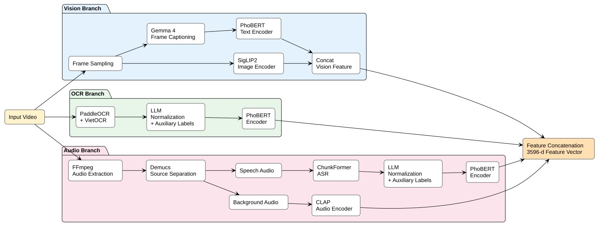
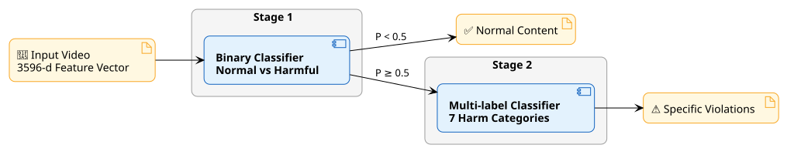
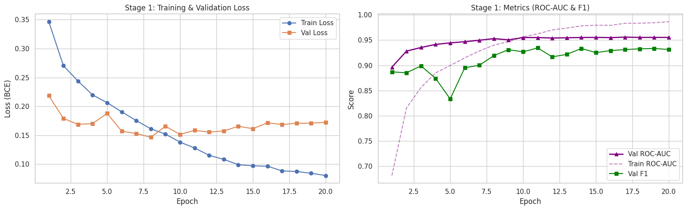
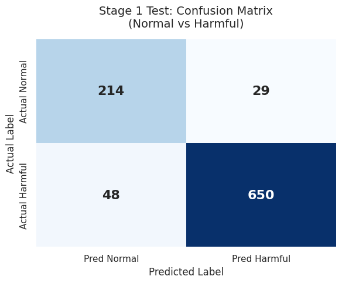
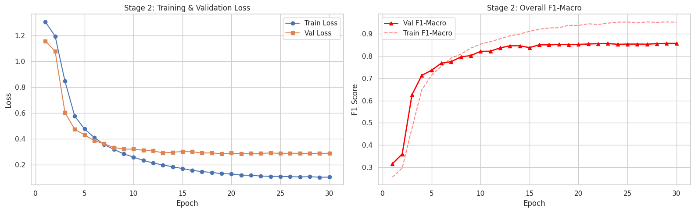
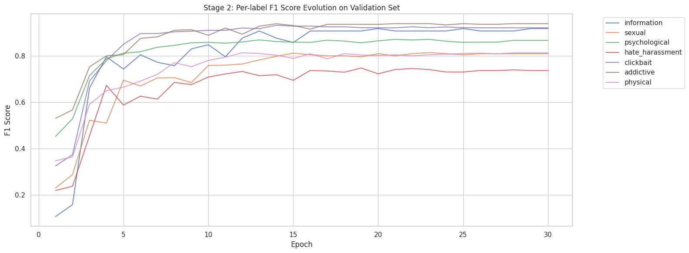
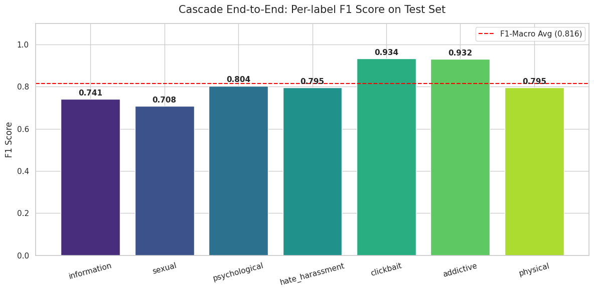

# HMM-Net: Hierarchical Multimodal Multi-label Network for Harmful Video Classification at Viet Nam

The explosive growth of short-form video platforms (like TikTok and Reels) brings massive content moderation challenges. A harmful video might hide behind normal visuals while the audio contains offensive language, or the video might seem safe but the on-screen text (OCR) is clickbait or a scam. Relying on a single modality (only vision or only audio) is insufficient.

**HMM-Net** provides a comprehensive solution: A **Multimodal** and **Hierarchical** machine learning system. It acts as a "gatekeeper" to detect harmful videos and accurately classifies which of the 7 specific policies the video violates.

---

## 📂 Project Structure

The entire pipeline, from raw data processing to model training, is systematically organized in the `src/` directory:

```bash
src/
├── pre-processing/
│   ├── asr/          # Speech-to-text (Whisper), LLM Normalize & Embeddings Extraction
│   ├── audio/        # Ambient audio feature extraction (CLAP)
│   ├── ocr/          # On-screen text extraction (PaddleOCR), LLM Normalize & Embeddings
│   ├── video/        # Frame sampling, Scene Description (Gemma 4), SigLIP2 & PhoBERT Embeddings
│   ├── dataloader/   # Dataset splitting (Iterative Stratification)
│   └── eda/          # Exploratory Data Analysis and Statistics
└── training/
    └── pipeline-training-hierarchical.ipynb  # End-to-end Cascade training notebook
```

---
## Dataset
- We Collected and manually annotated a 6,285-video Vietnamese TikTok harmful-content dataset by extending the **[MetaHarm](https://arxiv.org/abs/2504.16304)** taxonomy with a new harmful category and localized definitions for child safety.
## Harmful Content Taxonomy

| Category | Scope | Typical Examples |
|----------|-------|------------------|
| **Information Harms** | Content that spreads misinformation, disinformation, conspiracy theories, unverified medical treatments, fabricated news, or anti-government propaganda targeting Vietnam. | Fake news, conspiracy theories, unverified health advice, fabricated stories, anti-state propaganda. |
| **Hate and Harassment Harms** | Content containing insults, abusive language, identity attacks, or hate speech targeting individuals or groups based on gender, race, ethnicity, age, religion, political ideology, disability, or sexual orientation. | Hate speech, harassment, identity-based discrimination, offensive slurs, targeted abuse. |
| **Addictive Harms** | Content that promotes or encourages addictive or harmful behaviors, including online gaming addiction, drug use, smoking, alcohol consumption, and gambling. | Online gaming promotion, drug-related content, smoking, alcohol abuse, gambling videos. |
| **Clickbait Harms** | Content designed to manipulate user engagement through misleading or sensational claims, fraudulent financial schemes, superstition, or rumor promotion. | Clickbait titles, game account trading, get-rich-quick schemes, financial scams, rumor spreading, superstition, fortune-telling, love spells. |
| **Physical Harms** | Content depicting or promoting self-harm, suicide, eating disorders, dangerous challenges or pranks, and graphic violent content. | Self-harm, suicide-related content, eating disorder promotion, dangerous challenges, graphic violence. |
| **Sexual Harms** | Content containing sexually explicit material, nudity, sexual activities, sexual exploitation, or sexually suggestive performances. | Pornography, nudity, sexual acts, sexual abuse, sexually explicit conversations, revealing dance videos. |
| **Psychological Harms** | Content that may cause psychological distress, fear, or emotional discomfort, including horror, supernatural, or depressive content. | Horror videos, ghost or supernatural content, disturbing scenes, emotionally depressing or stressful videos. |


## ⚙️ Pre-processing Pipeline

The raw dataset (6,285 videos) undergoes independent processing across 4 modalities to extract maximum context:

### 1. 👁️ Vision (`src/pre-processing/video`)
Visuals are core but can be noisy without context.
- **Extract Frames:** Sample 8 representative frames per video.
- **Scene Description:** Use a Vision-Language Model (Gemma 4) to describe the scene in text, helping the model understand "actions" rather than just static pixels.
- **Embedding:** Generate feature vectors using **SigLIP2** (for images) and **PhoBERT** (for text descriptions), followed by Concat.

### 2. 🗣️ ASR (`src/pre-processing/asr`)
- **Transcribe:** Use ChunkFormer to transcribe all dialogues.
- **LLM Normalize & Priors:** Use an LLM to clean the text and act as an early moderator to generate prior predictions (Tabular Priors) for the 7 harmful labels.
- **Sliding Window Embedding:** Long transcripts exceed the model's token limit. We apply a **Sliding Window** mechanism combined with **PhoBERT** to preserve semantic meaning.

### 3. 📝 OCR (`src/pre-processing/ocr`)
- **Extract:** Scan frames using PaddleOCR to detect and VietOCR to recognize text.
- **Clean & Normalize:** OCR data is often messy. We use an LLM to group text, fix typos, and generate 5 Auxiliary Priors.
- **Embedding:** Extract features using **PhoBERT**.

### 4. 🎵 Ambient Audio (`src/pre-processing/audio`)
Background sounds (explosions, screaming, or specific music) provide excellent context.
- Preprocessing: Use Demucs to separate audio into No_Vocals
- Use the **CLAP** (Contrastive Language-Audio Pretraining) model to embed audio signals into a 512-dimensional vector.

### 5. 🗂️ Data Splitting (`src/pre-processing/dataloader`)
- We use the `IterativeStratification` algorithm to create a 70/15/15 (Train/Val/Test) split. This ensures that extremely rare labels (like `information_harm`) are evenly distributed without causing data leakage.

---

## 🏗️ Architecture & Training

The entire process converges in `src/training/pipeline-training-hierarchical.ipynb`. We apply a coarse-to-fine strategy using a **Cascade Pipeline**.





### Training Strategy (Warm-start)
*   **Stage 1 (Harm Detection):** Uses `BCEWithLogitsLoss` with `pos_weight` to handle the Normal vs Harmful class imbalance. We apply a **Dropout of 0.5** to force the model to learn robust features and completely eliminate overfitting.
*   **Stage 2 (Specific Violation Classification):** Uses a **Warm-start** approach. The trained weights from Stage 1 are loaded. The MLP body is frozen for the first 2 epochs to let the new 7-neuron Head adapt. Afterward, the entire network is unfrozen with a smaller Learning Rate for fine-tuning.

---

## 📈 Experimental Results

The hierarchical architecture results in an extremely stable and robust system.

### 1. Stage 1: Reliable Gatekeeper
Thanks to high regularization (Dropout 0.5), the learning curve is smooth with no overfitting.
*   **Val ROC-AUC:** Reached **0.958** at Epoch 15.
*   Achieved **93.1%** Recall (missing only 48 harmful videos) and **95.7%** Precision, ensuring that almost no safe videos were wrongly passed to Stage 2.





### 2. Stage 2 Evolution
By warm-starting from Stage 1, Stage 2 converges rapidly. Right after unfreezing at epoch 3, the F1-Macro jumps vertically from 0.3 to almost 0.7 and smoothly plateaus at 0.85.




### 3. End-to-End Cascade Evaluation
When connecting the full pipeline (Video -> Stage 1 -> Stage 2) and evaluating on the unseen Test Set, the system achieves impressive scores:

> **F1-Macro: 0.816** | **F1-Micro: 0.826**

Per-label F1 Performance:
- 🥇 `clickbait_harm` (0.934) & `addictive_harm` (0.932): Top performance due to seamless integration between vision (gameplay screens) and text (OCR keywords).
- 🥈 `psychological_harm` (0.804) & `physical_harm` (0.795): Excellent handling of violent or dark visuals, heavily compensated by Scene Description and Audio.
- 🥉 `information_harm` (0.741) & `sexual_harm` (0.708): The hardest labels (requiring fact-checking or distinguishing between fashion and explicit content) still achieved highly acceptable scores for production environments.



---
*Project: Hierarchical Multimodal Multi-label Classification*
